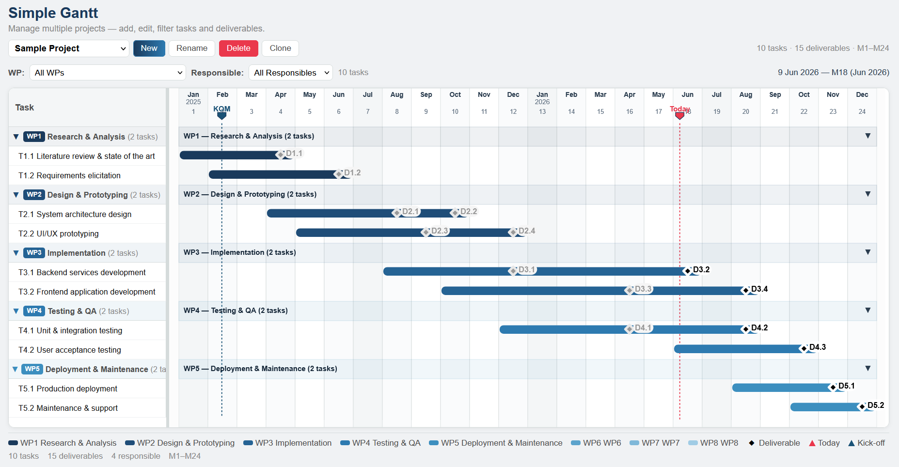

# Simple Gantt

A self-contained, browser-based Gantt chart editor for managing multi-project timelines with tasks, deliverables, and work packages.



## Features

- **Multi-project support** — manage multiple projects in a single file
- **Work Packages (WP)** — group tasks by WP, with editable names and responsible per project
- **Deliverables** — milestone markers on the Gantt chart, visually differentiated (past vs future)
- **Responsible tracking** — assign responsible to tasks and deliverables
- **Responsible filtering** — filter tasks by responsible
- **Collapsible WP groups** — collapse/expand WP sections in the Gantt
- **Today marker** — shows current project month with a flag indicator
- **Calendar dates** — shows actual calendar dates (e.g., "May 2025") alongside project months in the editor
- **Data editor** — inline editing of WP names, responsible, tasks, and deliverables
- **Import/Export** — JSON format for portability
- **Save as HTML** — generates a self-contained HTML snapshot with all project data embedded
- **LocalStorage persistence** — data persists across browser sessions

## Usage

1. Open `index.html` in any modern browser (or visit the GitHub Pages URL)
2. The demo project loads automatically on first use
3. Use the toolbar buttons to create, rename, clone, or delete projects
4. Edit WP names, tasks, and deliverables in the **Data Editor** panel below the Gantt
5. Export your project as JSON or save the entire editor as a standalone HTML file

### Importing sample data

1. Click **Import JSON**
2. Select `sample-project.json`
3. The sample project will be added to your project list

### Keyboard & navigation

- **WP filter dropdown** — filter the Gantt to show only tasks from a specific WP
- **Responsible filter dropdown** — filter tasks by responsible
- **Click WP header** — collapse/expand a WP group
- **Drag column edges** — resize table columns in the data editor
- **Drag left panel edge** — resize the label panel

## File structure

```
index.html            — The complete editor (single HTML file, no dependencies)
sample-project.json   — Sample project data for testing/demo
```

## Browser compatibility

Works in any modern browser (Chrome, Firefox, Edge, Safari). No server or build step required.
